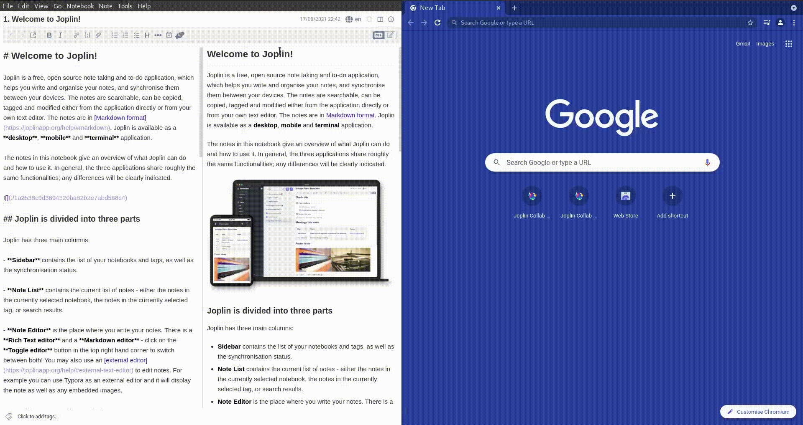

  
# Joplin Plugin: Collab-Note
  
This plugin enables the use of the Collaborative web app by adding an option to the config screen

and also adds a toolbar option to open the note in the Collaborative web app

Before you can use the plugin, the Web Clipper service should be enabled in 

`Tools>Options>Web Clipper` 

****
This is a template to create a new Joplin plugin.

The main two files you will want to look at are:

- `/src/index.ts`, which contains the entry point for the plugin source code.
- `/src/manifest.json`, which is the plugin manifest. It contains information such as the plugin a name, version, etc.

## Building the plugin

The plugin is built using Webpack, which creates the compiled code in `/dist`. A JPL archive will also be created at the root, which can use to distribute the plugin.

To build the plugin, simply run `npm run dist`.

The project is setup to use TypeScript, although you can change the configuration to use plain JavaScript.

## Updating the plugin framework

To update the plugin framework, run `npm run update`.

In general this command tries to do the right thing - in particular it's going to merge the changes in package.json and .gitignore instead of overwriting. It will also leave "/src" as well as README.md untouched.

The file that may cause problem is "webpack.config.js" because it's going to be overwritten. For that reason, if you want to change it, consider creating a separate JavaScript file and include it in webpack.config.js. That way, when you update, you only have to restore the line that include your file.
