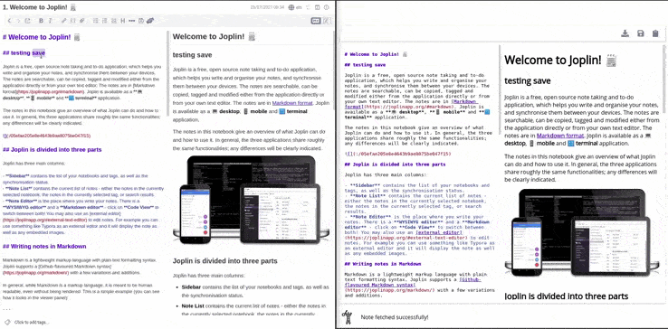
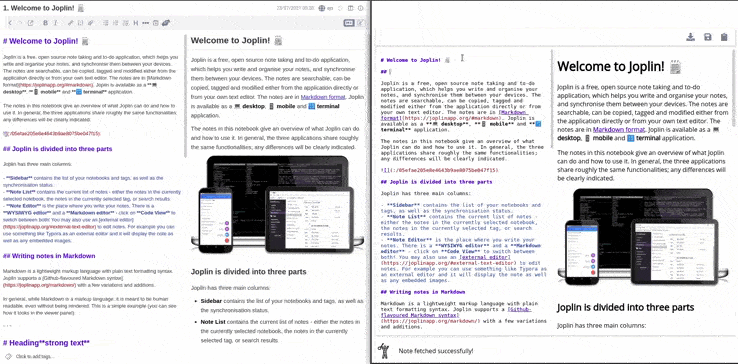
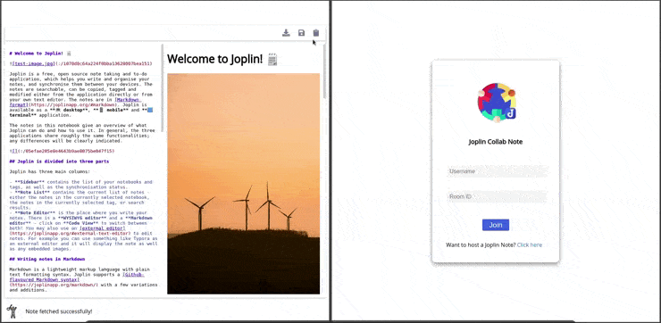

# Collaborative Editor

## Toolbar Options

Currently, there are 3 options available

### Fetch Note

The fetch option is available only for the host to fetch the note from the Joplin Desktop app. This is useful if there are any changes made to the note through the Joplin Desktop app as demonstrated below

### Save Note

Save option is also a host-specific option used to save the changes made through the Collaborative editor back to Joplin Desktop.

### Copy Room ID

To invite other users to collaborate on the note you can copy the room ID and share it with them. Using which they can join the collaborative session.

